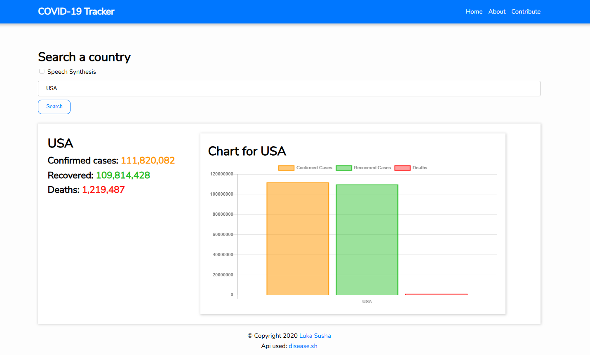

# COVID-19 Tracker

A responsive COVID-19 tracking web application built with vanilla JavaScript, HTML, and CSS that displays live global and country-specific pandemic statistics using public APIs, also built in speech synthesis feature for audio-based statistic announcements.

## Live Demo

🌐 https://lander2003.github.io/Covid19-Tracker/index.html

---

## Features

- Live worldwide COVID-19 statistics
- Country-specific pandemic tracking
- Interactive data visualization
- Speech synthesis for audio-based statistic announcements
- Responsive design for desktop and mobile
- Real-time API integration
- Clean and lightweight frontend implementation

---

## Screenshots

### Homepage



## Tech Stack

### Frontend
- JavaScript
- HTML5
- CSS3

### Libraries & Tools
- Chart.js
- Axios

### APIs
- COVID-19 public statistics API

---

## Installation

Clone the repository:

```bash
git clone https://github.com/Lander2003/Covid19-Tracker.git
```

Navigate into the project folder:
```cmd
cd Covid19-Tracker
```
Install dependencies:
```nodejs
npm install
```
Start the project locally:
```nodejs
npm start
```
What I Learned

This project helped me improve my understanding of:

DOM manipulation with JavaScript
Fetching and displaying API data
Asynchronous programming
Data visualization with charts
Responsive frontend design
Structuring frontend applications without frameworks
Deploying applications with GitHub Pages
Future Improvements
Add historical trend analysis
Improve accessibility
Add loading and error states
Improve mobile responsiveness
Add country search and filtering
Deployment

This project is deployed using GitHub Pages.

Author

Luka Susha Mochevikj

GitHub: https://github.com/Lander2003
LinkedIn: https://www.linkedin.com/in/luka-susha-mochevikj-217721239
